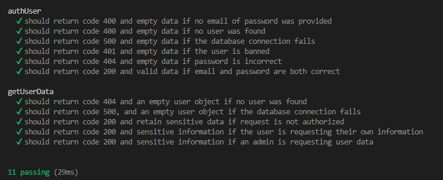
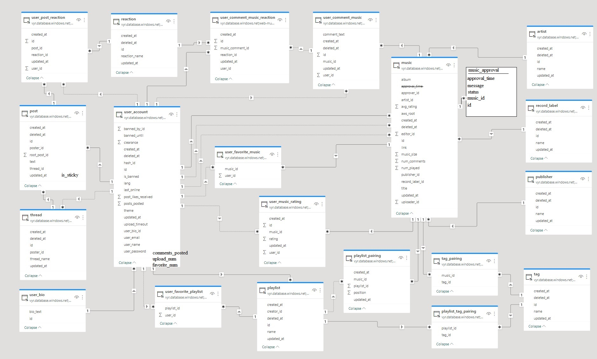

# ReadMe - Melody Bits Server

## Table of Contents

- [ReadMe - Melody Bits Server](#readme---melody-bits-server)
  - [Table of Contents](#table-of-contents)
  - [Installation](#installation)
  - [Testing](#testing)
  - [Overview](#overview)
    - [Database](#database)
    - [Registration](#registration)
    - [Authentication](#authentication)
    - [Uploading music](#uploading-music)
    - [Music download](#music-download)

---

## Installation

Before the project can be built, a few environment variables must be configured.

Among other things, this can be achieved with a `.env` file like the below example:

``` env
PORT=<PORT_NUMBER>

DB_USER=<MS_SQL_USERNAME>
DB_PWD=<MS_SQL_PASSWORD>
DB_URL=<MS_SQL_URL>
DB_NAME=<MS_SQL_DATABASE_NAME>

JWT_PVK=<JASON_WEB_TOKEN_PRIVATE_KEY>

AWS_ACCESS_KEY_ID=<AWS_S3_ACCESS_ID>
AWS_SECRET_ACCESS_KEY=<AWS_S3_ACCESS_KEY>
```

To properly function, the server requires access to an **SQL Server Database** and an **Amazon Web Services S3 Bucket**.

Once we have set the environment variables, we can build by project by typing:

```
$ npm run build
```

The compiled files should appear in an **out** folder.

---

## Testing

A few tests are available for some of the most critical functionalities of the server.

The tests were written with the combination of **Mocha**, **Chai** and **Sinon**.

The currently implemented tests assert that user data is only accessible by authorized users.

To run the tests, eneter the following command:

```
$ npm run test
```



---

## Overview

The server has numerous endpoints for authenticating users, and interacting with user and music data.

Before discussing how data is handled by the server, it's worth mentioning the database structure behind it.

### Database

The server uses an SQL Server database. Currently, there are a few unusued tables ready for future functionalities.



Two of the central tables are the **user_account** and the **music** ones.

Many **join tables** add provide room for additional functionalities:

- **user_favorite_music** table stores music ids which a user favorited
- **user_music_rating** table stores ratings that a user added to a music
- **artist, record_label and publisher** are **lookup tables** for the music table
- **tag** table is a lookup table for both the **music** and the **playlist** table.
- **tag_pairing and playlist_tag_pairing** are join tables between the tags, and the music and playlist tables.
- **user_bio** is a supporting table for the **user_account** primary table, storing "biography" text that the user added to their profile.
- **music_approval** is a supporting table, storing information about a music that relates to its approval status. Moderators can interact with this table when they approve, return for revision or terminate a user submission.

---

### Registration

Users can register through the **registerUser** GraphQL mutation endpoint. It expects a username, and email and a password asarguments.

If the email is not present in the database already, the password is hashed with **bcrypt**, and a new entry is inserted into the **user_account** table with the new user's data.

---

### Authentication

Users are authenticated when they provide a valid **Jason Web Token** in the Authorization section of the request's header.

To recieve a token, and thus authenticate themselves, users can send a request containing their **username** and **password** to the **authUser** GraphQL query endpoint.

If successful, the server responds with a JSON object, which has a token field with a valid JWT.

The server checks the Authorization section of the request's header to see if a valid token is present. If it is present, a jwtAuth Object is added to the request with the authenticated user's id.

---

### Uploading music

Music data can be uploaded as **form data** to the **/music-data/post-new** REST endpoint.

The server verifies that the uploader is allowed to upload music data, and then validates the sent data.

If the previous step is successful, the music data - besides the image and audio file - is uploaded to the SQL Server.

If database insert was successful, the cover image is compressed, and uploaded with the audio file to the S3 bucket.

If all operations were successful, the local copy is deleted and a status code of 201 is returned.

If any of the operation fails, all data is deleted that has been stored eaither locally or in one of the cloud services.

---

### Music download

Music data can be downloaded from the **getMusicData** GraphQL query endpoint.

There is a wide range of potential parameters that can be passed to filter the resulting list of music data.

Each music dataset has a link for both the cover image and the audio. The respective content is provided by the server via a REST endpoint indicated by the link.

Instead of sending the audio data whole, it streams the data for a ebtter user experience.